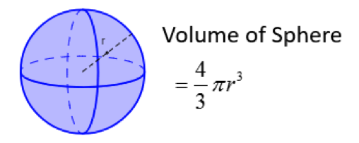

# DAT100: Java Programmering 2 - tirsdag/onsdag uke 2

## Programmeringsoppgaver fra forelesninger

De som ikke kom helt i mål med installasjon og programmeringsoppgaver i uke 1 kan bruke programmeringslab den første del av uken til å få dette på plass.

Husk å spørre om hjelp om dere sitter fast med noe.

Fra uke 1 er det oppgaven om Demonstrere kjørende Java programmer, Java Quiz 1: Kap 1 og Kap 2.1, Kap 2.2 og Lesetids-oppgave med spørsmål til Kap 1 og Kap 2 som er obligatorisk.

De andre programmeringsoppgaver fra uke 1 er ikke obligatoriske - men de er veldig viktige oppgaver å få gjort ift. lære seg stoffet fra uke 1.

Følgende programmeringsoppgaver som blev tatt opp på forelesning er også viktige som forberedelse frem mot den individuelle obligatoriske programmeringsoppgave som kommer neste uke

### Oppgave 1 - Momsberegning

Skriv et program som  Leser inn et beløp (desimaltall fra brukeren) via dialogvindu og beregner moms og totalpris. Etterfølgende skal programmet skrive ut en kvittering ut (i dialogvindu) med beløp, moms (MVA) og totalpris med avrunding til to desimaler

Du kommer til å få bruk for metoden `parseDouble` og da må du importere et bibliotek i programmet ved å bruke

```java
import static java.lang.Double.*;
```

### Oppgave 2 - Vekslepenger

Skriv et program som leser inn en pris og et beløp (begge heltall) som er betalt og beregner hvor mange 10 og 1-kr kunden skal ha igjen i vekslepenger slik kunden får færrest mulig antall mønter tilbake.

**Hint:** Operatoren `%` (modulo) gir rest ved heltalldivisjon.

### Oppgave 3 - Kulevolum

Skriv program som beregner volum av en kule ved bruk av Math-biblioteket:

https://docs.oracle.com/en/java/javase/11/docs/api/java.base/java/lang/Math.html


Konstanten `Math.PI` gir tilnærmet verdi for 𝜋


