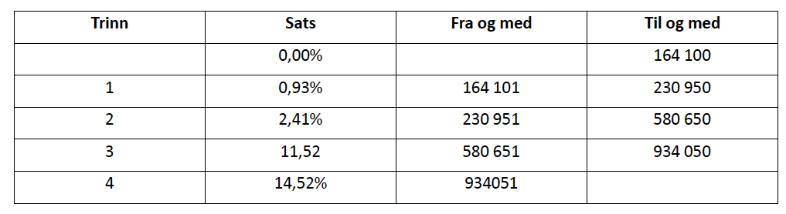
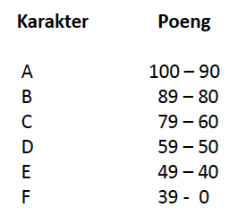

# DAT100: Java Programmering 2 - torsdag/fredag uke 2

## Programmeringsoppgaver

**Oppgavene 4 og 5 nedenfor vil være del av obligatorisk innlevering i neste uke.**

### Oppgave 1

Lag et program som leser inn to tall a og b, og skriver ut verdien av a/b hvis ikke b er 0, og en feilmelding ellers (siden det ikke går an å dele med 0).

### Oppgave 2

Du skal lage et program som leser inn tre heltall fra brukeren, og skriver ut igjen tallene sortert i stigende rekkefølge.

1. Løs oppgaven ved bare å bruke if-setninger.

2. Løs oppgaven ved å bruke if-else-setninger.

### Oppgave 3

Se på koden fra passords-eksemplet fra forelesning:

https://github.com/dat100hib/dat100public/blob/master/forelesninger/F03SetningerUttrykk/src/no/hvl/dat100/Login.java

Legg till to String variable som innholder korrekt brukernavne og passord. Bruk en if-setning til å sjekke om der er gitt korrekt login informasjon. For en tekststreng (String) `s1` kan `s1.equals(s2)` (se https://docs.oracle.com/en/java/javase/11/docs/api/java.base/java/lang/String.html) brukes til å sjekke om to strenger er lik (se etter equals metoden på siden).

I praksis vil en aldrig legge inn brukernavn og passord i selve programmet da det utgjør en sikkerhetsrisiko - men vi gjør det slik inntil vi har lært mer om programmering.

### Oppgave 4

En trinnskatt (tidligere toppskatt) er en progressiv skatt på brutto lønn som beregnes når inntekten er
høyere enn 164 100kr.



Lag et program som leser inn bruttoinntekt, beregner og skriver ut trinnskatten.

### Oppgave 5

#### a)

Lag et program som leser inn en poengsum (heltall) som en student har oppnådd på en prøve, og finn
og skriv ut den karakteren A-F dette tilsvarer. Grenser for de ulike karakterene skal være:



Skriv ut feilmelding ved ugyldig poengsum (negativ verdi eller over 100).

#### b)

Utvid programmet i pkt. a) slik at det kan lese inn poengsummer fra 10 studenter og skrive ut karakteren
(eller feilmelding) etter hver innlesing. **HINT:** hvordan kan du bruke en for-løkke til dette.

#### c)

Legg inn kontroll på innlesinga i programmet i pkt. b) slik at ugyldige poengsummer (negativ verdi eller over 100) må leses inn på nytt.

#### Oppgave 6 - Debugging

Som beskrevet i læreboken innebærer «Debugging» - eller feilfjerning – å kjøre et program steg for steg for å finne og fjerne feil. Utviklingsverktøy som Eclipse støtter dette og gjør det mulig bla. å inspisere tilstanden av programmet dvs. verdier av variable underveis.

I tillegg til feilfinning og feilfjerning kan stegvis utførsel også være nyttig for å forstå hvordan de ulike konstruksjoner i Java fungerer (semantikken).

Les først og gjør stegene:

https://github.com/dat100hib/dat100public/blob/master/eclipse/debugging.md

som gir en introduksjon til debugging i Eclipse.

Se på JAVA programmet nedenfor som har til oppgave å beregne volum av en boks utefra høyde, bredde og dybde.

Legg programmet inn i et Eclipse prosjekt og test ved å kjøre programmet om det gir riktig resultat. Prøv eks. med høyde 2, bredde 4 og dybde 8. Forventet resultat er 2 * 4 * 8 = 64.

Bruk debugging som beskrevet i oppgave a) ovenfor til å finne og rette feilen.

```java
import javax.swing.JOptionPane;

public class BoksVolum {

  public static void main(String[] args) {

    int b, h, d;
    String btext, htext, dtext;

    // les inn høyde, bredde, dybde
    htext = JOptionPane.showInputDialog("Angi høyde:");
    btext = JOptionPane.showInputDialog("Angi bredde:");
    dtext = JOptionPane.showInputDialog("Angi dybde:");

    // konverter fra tekst til heltal

    h = Integer.parseInt(htext);
    b = Integer.parseInt(btext);
    d = Integer.parseInt(htext);

    int volum = b * h * d;

    String respons =
        "Volum [" + htext + "," + btext + "," + dtext + "] = " + volum;

        JOptionPane.showMessageDialog(null, respons);
      }
}
```
